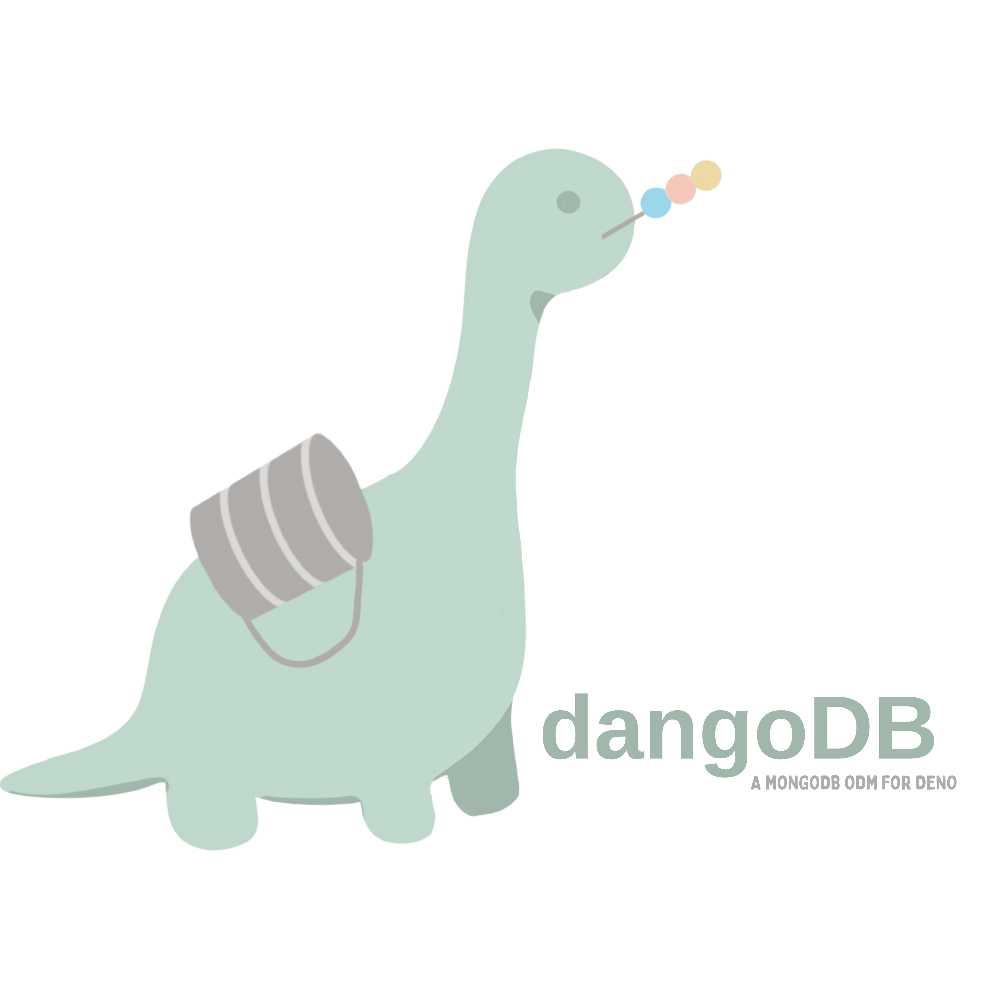

<div align="center">
  
</div>

<h1 align="center">dangoDB</h1>

<div align="center">A MongoDB ODM for Deno</div>
<br>
<div align="center"><a href="https://dangodb.land">Visit our Website</a></div>
<br>
<div align="center"><a href="https://medium.com/@stephen-jue/dangodb-a-mongodb-odm-for-deno-9ac46943fe54">Read our Medium Launch Article</a></div>
<br>

## Table of Contents

1. [Description](#description)
2. [Getting Started](#get-started)
3. [Query](#query)
4. [Schema](#schema)
5. [Authors](#authors)
6. [License](#license)

## <a name="description"></a>Description

<strong>dangoDB</strong> is a light-weight MongoDB Object Document Mapper (ODM) library built for the Deno runtime. It provides the core functionality and familiar look and feel of established Node-based libraries. With dangoDB, developers can construct schemas and models, and they can enforce strict type-casting and schema validation to structure their databases. The query functions available from the deno_mongo driver can all be accessed with ease. 

In addition, we built a user-friendly web-based [GUI](https://dangodb.land/#/schema) that auto-generates schema for users to copy and paste directly into their code. 


## <a name="get-started"></a>Getting Started

First, be sure that you have [Deno](https://deno.land) runtime installed and configured.

### Quick Start

In your application, import the dangoDB module from the deno.land [module](https://deno.land/x/dangodb).

```javascript
import { dango } from "https://deno.land/x/dangodb@v1.0.2/mod.ts";
```

### Connect to your Database

Next, open a connection to your MongoDB database using your URI string.

```javascript
await dango.connect('URI_STRING');

await dango.disconnect();
```

### Define Your Schema

Now, you can define a schema and create a reference to it as illustrated below.

```javascript
const dinosaurSchema = dango.schema(
  {
    name:                 // A property accepts the below options. Only type is required and must be a valid selection.
      { 
        type: 'string',   // Valid data types listed below.
        required: true,   // A boolean to indicate if the inserted property must have a value specified. Defaults to false.
        unique: true,     // A boolean to indicate if the inserted property much be unique in its value in the collection. Defaults to false.
        default: 'T-Rex', // A value to default to if none specified and required = false. Defaults to null.
        validator: null   // A user provided validation function that must return true with the casted value as input for the data to pass schema validation. Defaults to null.
      },
    age: 'number',        // A property can also accept a schema value with only a type indicated.
  }
);

/**
*  Valid datatypes:
*  - 'number'
*  - 'decimal128'
*  - 'string'
*  - 'boolean'
*  - 'objectid'
*  - 'uuid'
*  - 'date'
*  - userSchema            // User defined schema.
*  - array **              // In progress - Not yet implemented.
*
*/

```

### Create Your Model

Great! Now you have a schema with one property, name, which will be a 'string.' The next step is compiling our schema into a Model.

```javascript
const Dinosaur = dango.model('Dinosaur', dinosaurSchema);
```

### Make a Query

Now, let's insert a document into the Dinosaur model.

```javascript
await Dinosaur.insertOne({ name: 'Stegosaurus' });
```

Now, let's say you wanted to display all the dinosaurs in our collection. You can access all of the dinosaur documents through our Dinosaur model.

```javascript
const dinosaurs = await Dinosaur.find({ });
console.log(dinosaurs); 
// [ { name: 'Triceratops', age: 70,000,000 }, { name: 'Brontosaurus', age: 150,000,000 }, { name: 'Stegosaurus', age: null }];
```

Now you've successfully inserted a document into the Dinosaur collection at your MongoDB database. 

Congratulations! That's the end of the quick start. You've successfully imported dangoDB, opened up a connection, created a schema, inserted a document for Stegosaurus, and
queried all the dinosaurs in your Dinosaur model using dangoDB. Explore the rest of the readme.MD for more detailed instructions on how to use dangoDB.


## <a name="query"></a>Query

All queries in dangoDB are performed using models. The queries are built on the [deno_mongo](https://deno.land/x/mongo@v0.29.4) drivers. The documentation there may help guide query options. Listed below are all the query functions available in the dangoDB library.

#### Create, Read, Update, Delete Operations

- Model.deleteMany()
```javascript
Model.deleteMany()
/**
* @description Deletes all of the documents that match the conditions from the DB collection. It returns an object with 
* the property deletedCount, indicating how many documents were deleted. 
* @param queryObject - Query to specify which documents to delete.
* @param options - [optional]
* @param callback - [callback]
* @returns object with property deletedCount, value number. 
*/
```

- Model.deleteOne()
```javascript
Model.deleteOne()
/**
* @description Deletes the first document that matches the conditions from the DB collection. It returns an object 
* with the property deletedCount, indicating how many documents were deleted. 
* @param queryObject - The query used to find matching document.
* @param options [optional]
* @param callback [optional]
* @returns object with property deletedCount, value number.
*/
```
- Model.find()
```javascript
Model.find()
/**
* @ description Returns all documents that satisfy the specified query criteria on the collection or view. 
* @param queryObject - The query used to find matching documents.
* @param options - [optional] Additional options for the operation (e.g. lean, populate, projection)
* @param callback - [optional]
* @returns All matching documents in an array.
*/
```

- Model.findById()
```javascript
Model.findById()
/**
* @description Returns document that matches user provided ObjectId.
* @param queryObject - The query used to find matching document, using id.
* @param options - [optional] - Additional options for the operation (e.g. lean, populate, projection)
* @param callback - [optional]
* @returns Matching document.
*/
```

- Model.findByIdAndDelete()
```javascript
Model.findByIdAndDelete()
/**
* @description Deletes the first document that matches the id from the DB collection. It returns the document 
* with the matched property. 
* @param queryObject - The query used to find matching document, using id.
* @param options [optional]
* @param callback [optional]
* @returns the deleted document.
*/
```

- Model.findByIdAndRemove()
```javascript
Model.findByIdAndRemove()
/**
* @description Deletes the first document that matches the id from the DB collection. It returns the document 
* with the matched property. 
* @param queryObject - The query used to find matching document, using id.
* @param options [optional]
* @param callback [optional]
* @returns the document matched and removed.
*/
```

- Model.findByIdAndUpdate()
```javascript
Model.findByIdAndUpdate()
/**
* @description Updates the first document that matches the id from the DB collection. It returns the document 
* with the matched property. 
* @param filter - id used to find matching document.
* @param replace - User document to replace matching document at database.
* @param callback [optional]
* @returns the document matched.
*/
```

- Model.findOne()
```javascript
Model.findOne()
/**
* @description Returns first document that matches query.
* @param queryObject - Query used to find matching document. 
* @param options - [optional]
* @param callback - [optional]
* @returns Matching document.
*/
```

- Model.findOneAndDelete()
```javascript
Model.findOneAndDelete()
/**
* @description Deletes the first document that matches the filter from the DB collection. It returns the document 
* with the matched property. 
* @param queryObject - The query used to find matching document.
* @param options [optional]
* @param callback [optional]
* @returns the deleted document.
*/
```

- Model.findOneAndRemove()
```javascript
Model.findOneAndRemove()
/**
* @description Deletes the first document that matches the filter from the DB collection. It returns the document 
* with the matched property. 
* @param queryObject - The query used to find matching document.
* @param options [optional]
* @param callback [optional]
* @returns the deleted document.
*/
```

- Model.findOneAndReplace()
```javascript
Model.findOneAndReplace()
/**
* @description Finds a matching document, removes it, and passes in user's document. Replacement document retains same ObjectId as original document. 
* @param filter - Query used to find matching document.
* @param replace - User document to replace matching document at database.
* @param options - [optional]
* @param callback - [optional]
* @returns object displaying count for how many documents were upserted, matching, modified.
*/
```

- Model.findOneAndUpdate()
```javascript
Model.findOneAndUpdate()
/**
* @description Updates the first document that matches filter from the DB collection. It returns the document 
* with the matched property. 
* @param filter - id used to find matching document.
* @param replace - User document to replace matching document at database. 
* @param callback [optional]
* @returns the document matched.
*/
```

- Model.insertOne()
```javascript
Model.insertOne()
/** 
* @description Inserts one document into database collection. 
* @param document - User provided object to be inserted into the database.
* @returns ObjectId of inserted document.
*/
```

- Model.insertMany()
```javascript
Model.insertMany()
/**
* @description Insert multiple documents into database. 
* @param document - Array of document(s) to be inserted into database.
* @param options - [optional] 
* @param callback - [optional]
* @returns documents that passed validation.
*/
```

- Model.replaceOne()
```javascript
Model.replaceOne()
/**
* @description Finds a matching document, removes it, and passes in user's document. Replacement document retains same ObjectId as original document. 
* @param filter - Query used to find matching document.
* @param replace - User document to replace matching document at database. 
* @param options - [optional]
* @param callback - [optional]
* @returns The updated object.
*/
```

- Model.updateMany()
```javascript
Model.updateMany()
/**Parameters:
* @description Updates all documents that match queryObject. The matching fields in the DB collection will be set to the values in the updateObject.
* @param document - query used to find document(s) to update.
* @param update - object containing field(s) and values to set them to.
* @param options - [optional]
* @param callback - [optional]
* @returns object with properties upsertedId, upsertedCount, matchedCount, modifiedCount.
*/
```

- Model.updateOne()
```javascript
Model.updateOne()
/**
* @description Updates one document. The fields in the updateObject will be set to their respective values.
* @param document - query used to find document to update.
* @param update - object containing field(s) and values to set them to.
* @param options - [optional]
* @param callback - [optional]
* @returns object with properties upsertedId, upsertedCount, matchedCount, modifiedCount.
*/
```

#### Other Operations

- Model.aggregate()
```javascript
Model.aggregate()
/**
* @ description Aggregation operations process multiple documents and return computed results. You can use aggregation operations to:
* Group values from multiple documents together.
* Perform operations on the grouped data to return a single result.
* Analyze data changes over time.
* @param Aggregation pipeline as an array of objects.
* @returns Documents returned are plain javascript documents; 
*/
```

- Model.countDocuments()
```javascript
/**
Model.countDocuments()
* @description Counts number of documents matching filter in a database collection.
* @param document - query used to find document to update. 
* @param options - [optional]
* @param callback - [optional]
* @returns a count (number);
* example: query.countDocuments({ username: 'test' });
*/
```

- Model.dropCollection()
```javascript
Model.dropCollection()
/**
* @description DropCollection drops current model/collection that user is connected to.
* @returns undefined
*/
```

- Model.estimatedDocumentCount()
```javascript
Model.estimatedDocumentCount()
/**
* @description Returns the count of all documents in a collection or view. The method wraps the count command.   
* @param options - [optional]
* @param callback - [optional]
* @returns a count (number);
*/
```

## <a name="schema"></a>Schema

When creating a schema, either a type can be assigned to each property in string format, or an object with schema options properties.

#### Schema Options
- type - Number, decimal128, string, boolean, objectid, UUID, date, object. Specified as a lowercase string.
- required - Boolean, specifies whether a value is required in an inserted document or replacement document. 
- unique - Boolean, specifies whether a value is designated as unique for the property.
- default - Default value if no value is provided by user. Defaults to null.
- validator - User can provide a function test which the values to be inserted/updated need to pass before being inserted. Defaults to null.

To set the type for an embedded object, create a schema for that object, and assign that schema to the property that corresponds with the object.

```javascript
addressSchema = dango.schema(
  {
    house_number: 'number', 
    unit: 'string', 
    street: 'string', 
    city: 'string'
  }
);

personSchema = dango.schema(
  { 
    name: 'string', 
    address: addressSchema 
  }
);
```


## <a name="authors"></a>Authors

- [Bill Greco](https://github.com/wgreco13)
- [Steve Jue](https://github.com/kaizenjoo)
- [Celeste Knopf](https://github.com/DHolliday1881)
- [Emilia Yoffie](https://github.com/emiliayoffie)

## <a name="license"></a>License

This product is licensed under the MIT License - see the LICENSE file for details.

This is an open source product.

This product is accelerated by <a href="https://opensourcelabs.io/">OS Labs.</a>

